# Stock Reservation Engine

> A custom Odoo Inventory module that introduces **proactive stock reservation**, **intelligent FEFO/FIFO allocation**, **internal stock movement generation**, and **secure API exposure** with production-minded engineering practices.

---

## Objective

This project was built to satisfy the assignment requirement of extending Odoo Inventory with a **reservation and allocation engine** suitable for **high-volume, competing-demand environments**.

The business need behind the module is to move from reactive stock handling toward **controlled pre-allocation**, so critical requests can be secured early, shortages are handled predictably, and integrations with external systems can work through a clean API layer.

---

## Assignment coverage at a glance

| Area | Status | Notes |
| --- | --- | --- |
| Working Odoo module | ✅ Done | Installable application with models, views, demo data, and security |
| Custom reservation models | ✅ Done | Reservation batches, lines, and API tokens |
| Allocation engine | ✅ Done | FEFO if expiry exists, otherwise FIFO; partial allocation supported |
| Stock integration | ✅ Done | Stock moves and internal transfers generated from allocated quantities |
| API layer | ✅ Done | Create, allocate, and status endpoints with bearer-token authentication |
| UI integration | ✅ Done | Inventory menu integration, list/form views, smart buttons, dashboard |
| Security model | ✅ Done | Users see their own records; managers see all |
| Sprint simulation | ✅ Done | Structured Stage 1 / Stage 2 / Stage 3 delivery breakdown |
| Testing | ✅ Done | Functional, regression, and HTTP/API coverage |
| Performance and DB awareness | ✅ Done | Query, indexing, scaling, and concurrency discussion included |
| Bonus engineering items | ✅ Delivered | Internal pickings, dashboard, timing logs, API version aliases |

---

## Why this module matters

Standard Odoo inventory flows are often triggered only when stock moves are created. This solution adds a **business-first reservation layer** that allows teams to:

- reserve stock before fulfillment starts
- prioritize urgent or scheduled requests
- apply **FEFO** when expiry-sensitive inventory exists
- gracefully support **partial** and **no-stock** outcomes
- expose reservation behavior to outside systems through JSON APIs

---

## Live demo environment

A hosted review database is available for hands-on validation:

- **Demo URL:** [Live Odoo Database](https://sabryyoussef-assigment-inv-reserv.odoo.com/odoo)

| User | Login | Password | Use case |
| --- | --- | --- | --- |
| Administrator | admin | not listed here | Full administrative access |
| Assignment Admin | admin@stock-reservation-demo.local | 123 | Manager review, configuration, and token access |
| Assignment User | reviewer@stock-reservation-demo.local | 123 | Standard reviewer walkthrough |
| Demo Reservation User | demo_res_user | use configured demo password | Reservation-user behavior and record-rule review |

This environment allows the reviewer to test the module directly while following the screenshots and documentation below.

---

## Documentation and reference center

### Planning and assignment documents

| File | What it contains |
| --- | --- |
| [docs/assigments_planing/README.md](docs/assigments_planing/README.md) | Agile-style project board and reading order for assignment planning material |
| [docs/assigments_planing/ORIGINAL_ASSIGNMENT.md](docs/assigments_planing/ORIGINAL_ASSIGNMENT.md) | The original assignment brief and evaluation expectations |
| [docs/assigments_planing/ASSIGNMENT_COMPLETION_PLAN.md](docs/assigments_planing/ASSIGNMENT_COMPLETION_PLAN.md) | Sprint planning, priorities, and delivery execution roadmap |
| [docs/assigments_planing/REQUIREMENTS_VS_IMPLEMENTATION.md](docs/assigments_planing/REQUIREMENTS_VS_IMPLEMENTATION.md) | Requirement-by-requirement proof of implementation |
| [docs/assigments_planing/DELIVERY_STATUS.md](docs/assigments_planing/DELIVERY_STATUS.md) | Compact final completion status |

### Presentation and technical PDF pack

| File | What it presents |
| --- | --- |
| [docs/presentations_pdf/README.md](docs/presentations_pdf/README.md) | Guide to the PDF presentation pack |
| [docs/presentations_pdf/Odoo_Stock_Reservation_Engine.pdf](docs/presentations_pdf/Odoo_Stock_Reservation_Engine.pdf) | Main project presentation and business walkthrough |
| [docs/presentations_pdf/Odoo_18_API_Performance_Analysis.pdf](docs/presentations_pdf/Odoo_18_API_Performance_Analysis.pdf) | API and performance-oriented analysis |
| [docs/presentations_pdf/Odoo_18_Stock_Engine_Performance_Audit.pdf](docs/presentations_pdf/Odoo_18_Stock_Engine_Performance_Audit.pdf) | Performance audit and scale-awareness review |
| [docs/presentations_pdf/Stock_Reservation_Engineering_Review.pdf](docs/presentations_pdf/Stock_Reservation_Engineering_Review.pdf) | Architecture, trade-offs, and engineering review |
| [docs/presentations_pdf/Stock_Reservation_Engine_QA_Blueprint.pdf](docs/presentations_pdf/Stock_Reservation_Engine_QA_Blueprint.pdf) | QA blueprint and validation guide |

### Screenshots and supporting guides

| File | Purpose |
| --- | --- |
| [docs/screenshots_guide/SCREENSHOTS_INDEX.md](docs/screenshots_guide/SCREENSHOTS_INDEX.md) | Full screenshot index and explanation map |
| [docs/assigments_planing/README.md](docs/assigments_planing/README.md) | Planning and assignment navigation hub |
| [docs/presentations_pdf/README.md](docs/presentations_pdf/README.md) | PDF presentation and technical review guide |

---

## Visual walkthrough of the module

The following screenshots are embedded directly so the reviewer can understand the module flow **without opening many separate links**.

### 1. Accessing Odoo and opening the module

These screens show the login stage, landing page, and module discovery from the Apps menu.

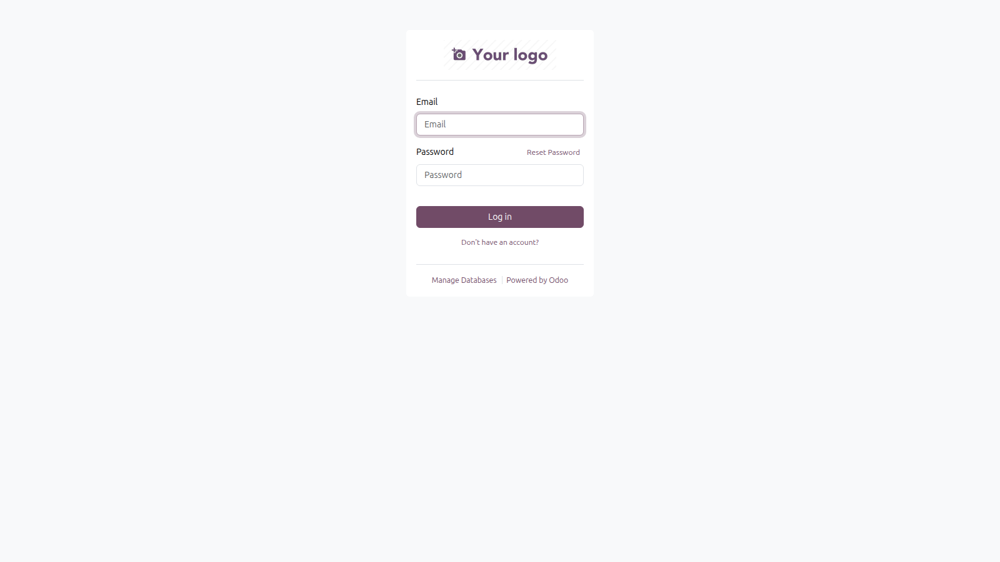


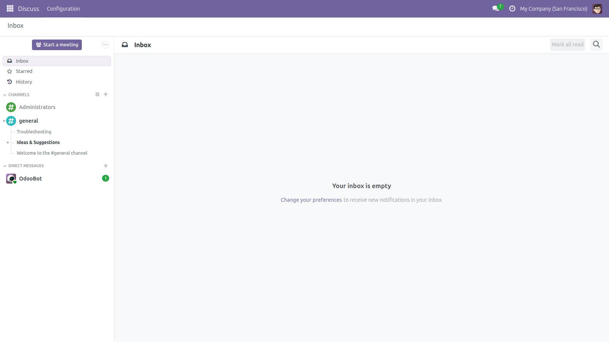

### 2. Inventory configuration required for FEFO/FIFO behavior

This screen supports the configuration story: locations, lots, and expiration dates are enabled so the allocation engine can make intelligent stock choices.

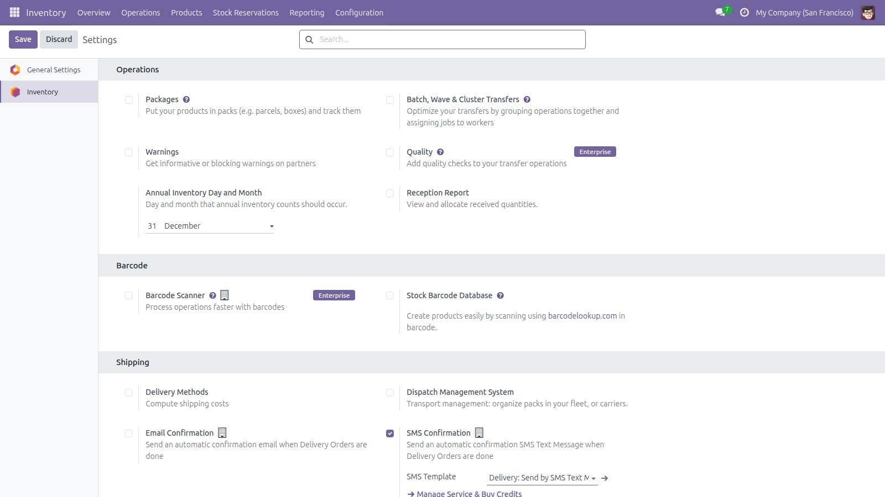

### 3. Product, variants, and lots setup

This set demonstrates the data model behind the reservation engine: storable products, variants, and lot-tracked stock with expiry support.

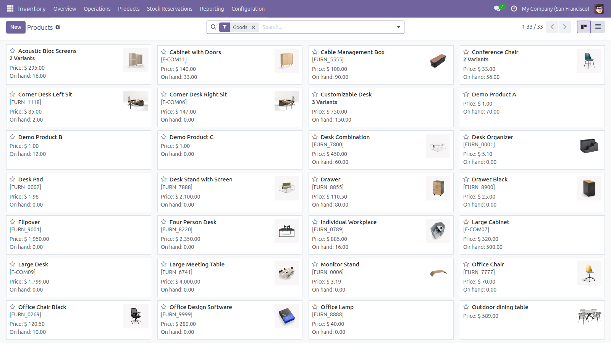

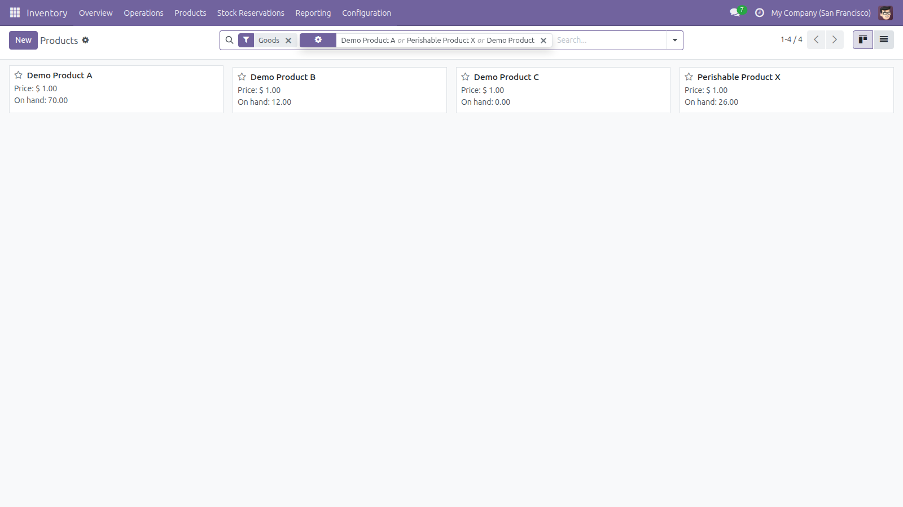

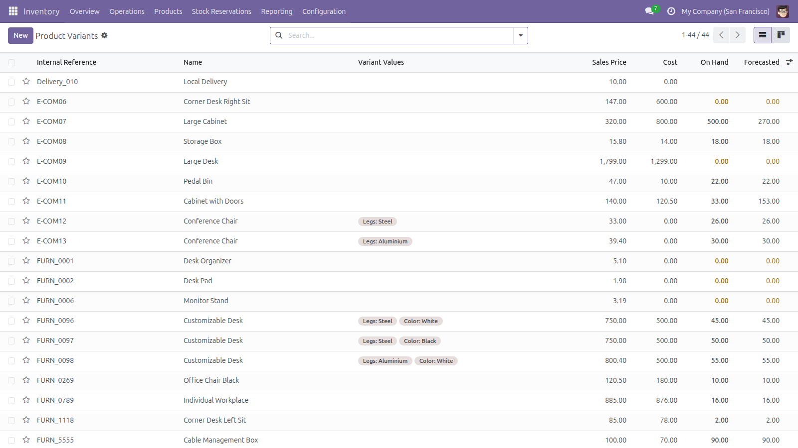

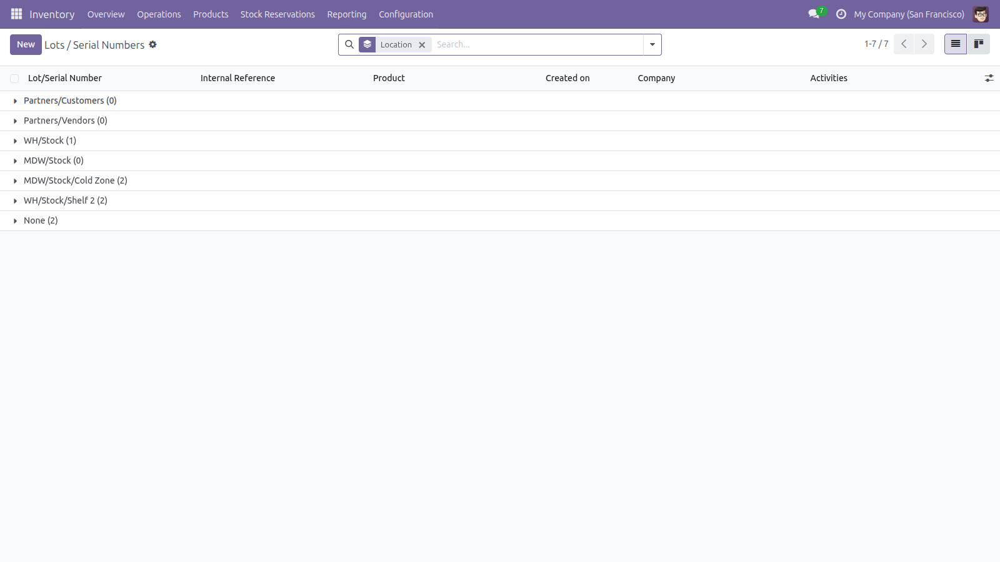

### 4. Reservation dashboard and batch list

This section highlights the custom UI added under Inventory. The dashboard gives operational visibility, while the batch list is the main working screen.

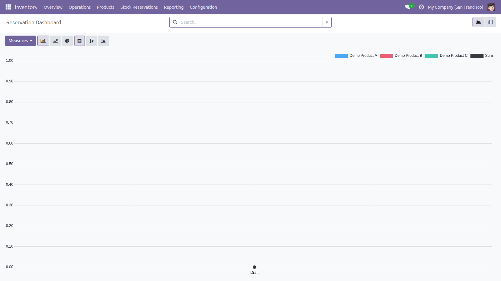

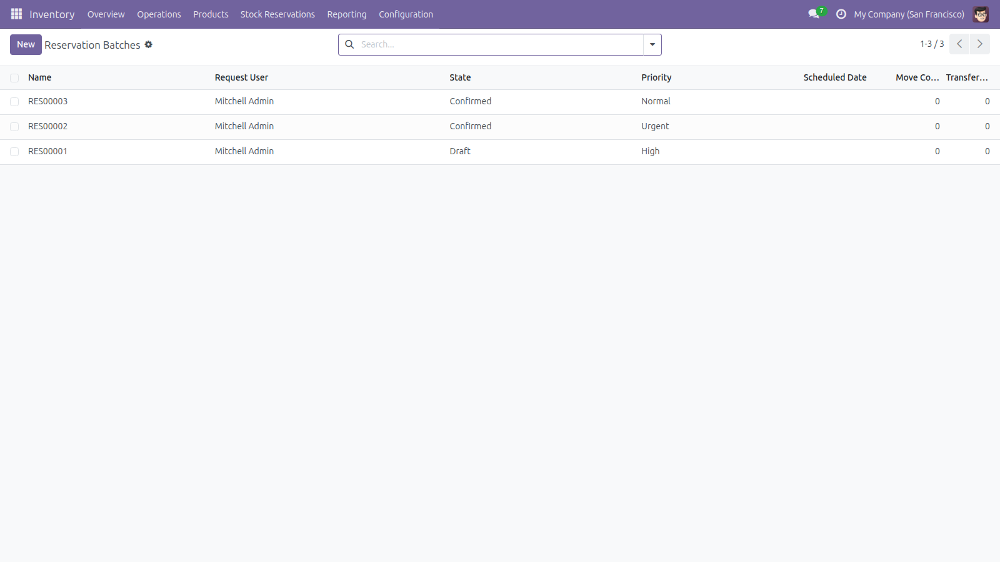

### 5. Allocation execution and generated stock records

This is the core business flow. After creating a batch and clicking **Allocate**, the module updates quantities, states, moves, and transfers.

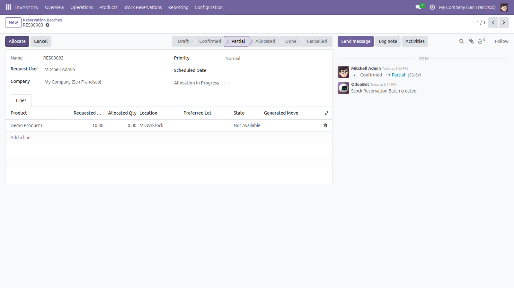

The next screen proves that related stock moves are generated from the allocated reservation lines.


This final image in the flow shows the internal transfers created from the allocated moves.


### 6. Creating new reservations and managing API tokens

The module also supports quick reservation entry and secure token management for external integrations.

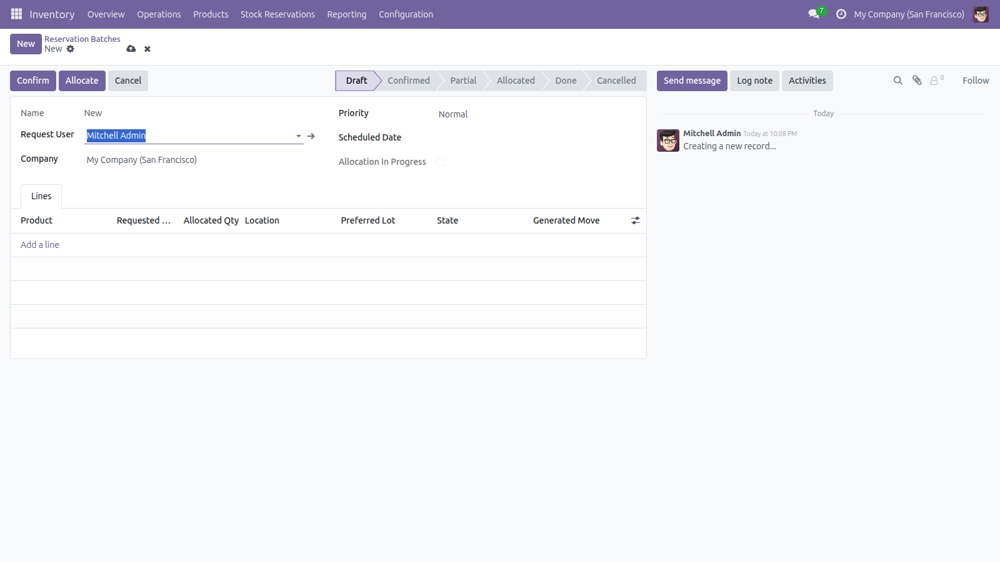

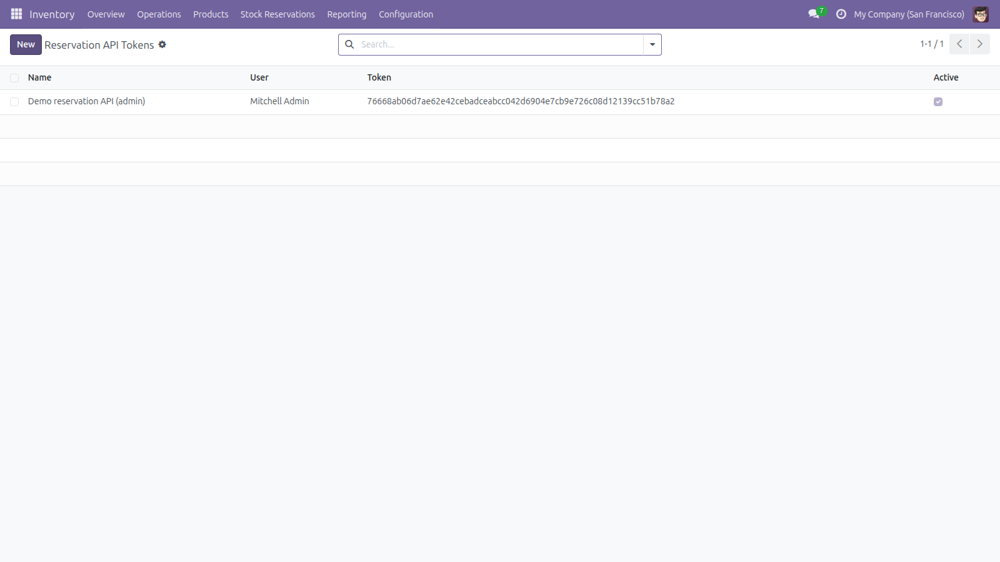

---

## Functional scope delivered

### Core models

The module provides the required functional entities:

- **`stock.reservation.batch`**
  - auto-sequenced name
  - request user
  - state, priority, scheduled date
  - line collection for reservation requests

- **`stock.reservation.line`**
  - product, location, requested quantity, allocated quantity
  - optional lot selection
  - per-line state and stock move reference

- **`reservation.api.token`**
  - secure bearer-token support for API access

### Allocation engine

When the user clicks **Allocate**, the module:

1. reads matching stock from **`stock.quant`**
2. respects the selected location and child locations
3. applies **FEFO** when expiry-aware lots exist
4. falls back to **FIFO** when expiry data is not available
5. supports full, partial, and no-stock outcomes
6. updates **`allocated_qty`** and line state accordingly

### Stock integration

After allocation, the module creates:

- linked **`stock.move`** records for allocated quantities
- internal **`stock.picking`** transfers grouped from the generated moves
- smart-button navigation from the reservation batch to these records

### API layer

The module exposes JSON endpoints for external systems:

| Method | Endpoint | Purpose |
| --- | --- | --- |
| POST | **`/api/reservation/create`** | Create a reservation batch |
| POST | **`/api/reservation/allocate`** | Trigger allocation |
| GET | **`/api/reservation/status/<id>`** | Fetch reservation status |

The API includes:

- token-based authentication
- clean JSON request and response structures
- error codes and validation messages
- HTTP/API regression testing

### UI and security

The module integrates directly into **Inventory** with:

- tree and form views
- dashboard reporting
- smart buttons for stock moves and transfers
- owner-only access for normal users
- full visibility for managers
- authorized allocation logic enforced on the server side

---

## Architecture decisions

### Why a batch-plus-lines structure?

A batch groups a reservation request at business level, while individual lines allow mixed outcomes across products or quantities. This keeps the workflow practical for real inventory teams.

### Why allocate from stock quant?

Availability is derived from **`stock.quant`** because it provides the closest picture of real on-hand stock, reserved quantities, and location-based availability.

### Why FEFO first, FIFO second?

If expiry-aware lots exist, the business should consume the earliest-expiring stock first. Where expiry is not available, FIFO is the practical default.

### Why internal transfers after allocation?

The implementation creates internal transfer records so reserved stock is represented in standard inventory operations without forcing an outbound delivery flow too early.

---

## Sprint delivery simulation

This assignment was structured as a realistic **3-day sprint**.

### Stage 1 — Foundation and data model

Priority items:

- scaffold the module
- define custom models
- add security groups and access rules
- build list and form views
- prepare sequence and demo data foundation

### Stage 2 — Allocation and stock integration

Priority items:

- implement allocation logic over stock quants
- support FEFO/FIFO and partial allocation
- generate stock moves and internal transfers
- add the API layer with token authentication

### Stage 3 — Testing, performance, and documentation

Priority items:

- write transaction and HTTP tests
- verify error handling and security scenarios
- document performance strategy and DB design
- finalize reviewer-facing documentation and screenshots

### Intentionally simplified or deferred

To keep delivery realistic within the assignment window, some advanced items were intentionally not expanded into full production subsystems, such as:

- full warehouse routing engine
- automatic post-transfer assignment logic
- rate limiting and advanced API governance
- queue-based concurrency retry orchestration
- custom JS dashboards beyond native graph and pivot reporting

---

## Performance strategy

The project includes performance thinking beyond basic functionality.

### Query behavior and N+1 avoidance

- allocation performs a focused stock quant lookup per reservation line rather than per quant row
- candidate quants are iterated in memory after retrieval
- related record navigation uses Odoo recordsets and prefetch-friendly operations
- token lookup uses a single indexed search on the stored hash

### Critical queries

The most important runtime queries are:

- stock quant searches by product, location, lot, and company
- internal picking type resolution
- token authentication lookup

### Scaling reasoning

As data volume grows, the design remains understandable and maintainable because:

- filtering is explicit and index-friendly
- FEFO adds sorting only when needed
- the engine can later be optimized further by batching similar lines

### Automation-based load and concurrency validation

To address the assignment’s performance and concurrency discussion, the API surface is suitable for **automation-driven endpoint testing** using tools such as **k6**, **Locust**, **JMeter**, or **Newman/Postman collections**. Supporting reviewer material is also provided in [docs/presentations_pdf/Odoo_18_API_Performance_Analysis.pdf](docs/presentations_pdf/Odoo_18_API_Performance_Analysis.pdf) and [docs/presentations_pdf/Odoo_18_Stock_Engine_Performance_Audit.pdf](docs/presentations_pdf/Odoo_18_Stock_Engine_Performance_Audit.pdf).

A representative validation scenario is:

- **50 virtual users** hitting the reservation endpoints
- mixed traffic across **create**, **allocate**, and **status** operations
- concurrent requests targeting overlapping stock to observe contention behavior
- verification of response stability, authorization, and predictable shortage handling

Representative endpoints for this validation:

- **POST** `/api/reservation/create`
- **POST** `/api/reservation/allocate`
- **GET** `/api/reservation/status/<id>`

### Sample log snippet

The module is designed to emit allocation timing information that helps reviewers inspect runtime behavior, for example. This runtime visibility is aligned with the performance evidence discussed in [docs/presentations_pdf/Odoo_18_API_Performance_Analysis.pdf](docs/presentations_pdf/Odoo_18_API_Performance_Analysis.pdf):

```text
INFO stock_reservation_engine.models.reservation_batch: Allocation line timing batch=RES00031 line_id=33 product_id=59 elapsed_ms=13.03 allocated_qty=2.0
INFO stock_reservation_engine.models.reservation_batch: Finished allocation for reservation batch RES00031 state=allocated lines=1 moves=1 total_elapsed_ms=13.30
```

---

## Database design and tuning

### Key indexes

| Model | Field | Why it matters |
| --- | --- | --- |
| **`stock.reservation.batch`** | `request_user_id` | supports security and user-scoped filtering |
| **`stock.reservation.batch`** | `company_id` | improves company filtering |
| **`stock.reservation.batch`** | `state` | supports workflow views and filtering |
| **`stock.reservation.line`** | `batch_id` | efficient One2many joins |
| **`stock.reservation.line`** | `product_id` | important for allocation lookups |
| **`stock.reservation.line`** | `location_id` | important for location-based allocation |
| **`stock.reservation.line`** | `state` | helps reporting and dashboard filters |
| **`reservation.api.token`** | `token` | speeds secure authentication lookups |

### Constraints

The module also enforces correctness with constraints such as:

- requested quantity must be greater than zero
- allocated quantity cannot be negative
- allocated quantity cannot exceed requested quantity
- token values are unique at database level

---

## Concurrency strategy

Concurrency awareness is part of the assignment and is addressed at both design and implementation levels.

### Main risks

- two users allocating the same batch at the same time
- two different batches competing for the same stock
- retry scenarios from external API clients

### Current safeguards

- allocation-in-progress protection on the batch
- predictable state restrictions for valid workflow transitions
- idempotent move and transfer generation behavior
- lock-aware allocation path to reduce race conditions

### Future production evolution

For very high contention environments, this can be strengthened further with:

- row-level SQL locking strategies
- retry/backoff behavior
- queue-based or serialized allocation handling

---

## Testing and validation

Testing is included as a **mandatory engineering requirement**, and the module satisfies it with both transaction-level and HTTP/API coverage.

### Main testing references

| Reference | Purpose |
| --- | --- |
| [tests/TEST_REPORT.md](tests/TEST_REPORT.md) | Main markdown test report with verified run details and test inventory |
| [tests/test_reservation.py](tests/test_reservation.py) | Core functional and allocation test cases |
| [tests/test_reservation_http.py](tests/test_reservation_http.py) | API and HTTP integration coverage |

### What is tested

The current test set covers:

- full allocation
- partial allocation
- no-stock scenario
- authorization rules
- batch state transitions
- cancellation behavior
- dashboard action wiring
- API create, allocate, and status flows
- HTTP authentication and validation errors

### API testing reference

API behavior is specifically documented in [tests/TEST_REPORT.md](tests/TEST_REPORT.md) and implemented in [tests/test_reservation_http.py](tests/test_reservation_http.py).

This includes coverage for:

- unauthorized access
- inactive tokens
- bad payload validation
- allocate errors and success paths
- status endpoint behavior
- versioned API alias support

---

## Known limitations

The module is delivery-ready, but some choices remain intentionally lightweight:

- complex warehouse routing is simplified to practical internal transfer logic
- dashboard uses native Odoo reporting rather than custom KPI widgets
- API rate limiting is not implemented
- extreme-contention retry orchestration is left as future hardening
- when `action_assign()` cannot fully reserve (insufficient net stock), `allocated_qty` is reconciled downward automatically and the batch state reflects the partial outcome

---

## Review-Driven Improvements

This section documents the changes made in response to a formal review that identified five critical gaps in the initial implementation.

---

### Gap 1 — Reservation semantics (highest priority)

**What was found:**
The allocation engine read `stock.quant` to compute available quantities and stored the result in `allocated_qty`, but it never incremented `stock.quant.reserved_quantity`. This meant that after allocation, the same stock remained freely claimable by any competing operation that ran before the transaction committed. The reservation was informational, not enforceable.

**What was changed:**
`_create_picking_for_moves` now calls `picking.action_assign()` immediately after `picking.action_confirm()`. This triggers Odoo's native `_action_assign` flow, which:

1. creates `stock.move.line` records tied to specific quants
2. increments `stock.quant.reserved_quantity`
3. puts the move in state `assigned` (or `partially_available`)

A new method `_sync_allocated_qty_from_moves` reads back `sum(ml.quantity for ml in move.move_line_ids)` after assignment and corrects `allocated_qty` if Odoo's engine reserved less than the pre-allocation scan expected. This ensures the custom figures are never overstated.

**Reservation strength now:**
Strong pre-allocation with Odoo-native hard reservation. After allocation, `stock.quant.reserved_quantity` is incremented, and competing flows that check `quant.quantity - quant.reserved_quantity` will correctly see zero available stock.

**Remaining limitation:**
This works within a single database transaction with NOWAIT locking. In extreme multi-process contention, the user receives a clear `UserError` asking them to retry. Full queue-based serialization is outside the scope of this module.

---

### Gap 2 — N+1 query pattern in FEFO / quant ordering

**What was found:**
`_get_quant_order(line)` was a separate method that performed an independent `stock.quant` search to detect whether any quants had expiry dates. This added one extra DB query per reservation line before `_allocate_line` then ran its own full quant search. Additionally, inside the FEFO sort key lambda, accessing `q.lot_id.expiration_date` would trigger one lazy ORM read per unique lot (another N+1 pattern as Odoo loads each `stock.lot` record individually).

**What was changed:**
- `_get_quant_order` was removed entirely.
- `_allocate_line` now fetches quants once and detects FEFO from that same result set: `any(q.lot_id and q.lot_id.expiration_date for q in quants)`. No second query needed.
- Before the sort, `quants.lot_id.mapped('expiration_date')` is called to trigger a single prefetch of all related `stock.lot` records. Subsequent accesses inside the sort lambda read from the ORM cache without issuing further queries.

**Why this matters:**
For a batch with 20 reservation lines, the old code issued at least 40 DB queries for FEFO detection alone (one `_get_quant_order` query + one full quant query per line), plus N lot reads inside each sort. The new code issues exactly one quant query and one lot query per line regardless of lot count.

---

### Gap 3 — API security: broad `su=True` privilege escalation

**What was found:**
In the `create_reservation` API endpoint, the authenticated user's environment was constructed with `su=True`:

```python
env_u = request.env(user=user.id, su=True)
```

`su=True` in Odoo's ORM sets the environment to superuser mode, which bypasses **all** model-level access control, record rules, and group checks. This meant any valid API token holder could create reservation batches as if they were a superuser, ignoring the `group_stock_reservation_user` / `group_stock_reservation_manager` permission boundary entirely.

**What was changed:**
`su=True` was removed. The environment is now created as:

```python
env_u = request.env(user=user.id)
```

This respects normal Odoo access control. If the token's associated user lacks the required group, the creation will raise an `AccessError` and the endpoint returns a clean `403 ERR_FORBIDDEN` response.

Additionally, a new `ERR_CONFLICT` error code was added to the `allocate_reservation` endpoint. When a NOWAIT lock conflict is detected (another process is allocating the same batch), the response body now returns `code: "ERR_CONFLICT"` rather than the generic `ERR_VALIDATION`. This allows API clients to implement targeted retry logic for transient contention.

**Remaining scope:**
The `sudo()` browse in `allocate_reservation` and `reservation_status` is retained for the existence/ownership check pattern (check if batch exists before enforcing ownership). This is an intentional, documented pattern and does not elevate any data access beyond the ownership assertion.

---

### Gap 4 — FEFO not convincingly tested

**What was found:**
The existing test suite had no test that explicitly proved FEFO behavior. There was no case that created multiple lots with different expiry dates, added stock, and verified that the earliest-expiring lot was selected.

**What was added:**
Three new tests in `tests/test_reservation.py`:

1. **`test_fefo_allocates_earliest_expiry_lot_first`** — creates two lots (`lot_early` at +5 days, `lot_late` at +30 days), adds stock for both (deliberately more stock in the early lot), requests 4 units, and asserts that `line.lot_id == lot_early`. Lot creation and stock insertion order is designed to rule out accidental FIFO-by-id passing the test.

2. **`test_fefo_spans_lots_in_expiry_order`** — creates three lots (A=+3d, B=+10d, C=+60d), adds stock in reverse order (C first, A last), requests 5 units (more than lot A alone), and asserts that `line.lot_id == lot_a` (earliest expiry selected first, C never touched).

3. **`test_native_reservation_protects_stock_from_competing_batch`** — allocates all available stock via batch 1, asserts that `stock.quant.reserved_quantity > 0`, then allocates batch 2 for the same product and asserts `allocated_qty == 0`. This is the definitive proof that native reservation is enforced and not just informational.

---

### Architecture decisions updated

**Why `action_assign()` after `action_confirm()`?**

`action_confirm()` validates the moves and sets them to state `confirmed`. `action_assign()` is the Odoo call that actually reserves stock: it searches quants, creates `stock.move.line` records, and increments `reserved_quantity`. Calling both in sequence is the standard Odoo pattern for confirmed-then-reserved internal transfers.

**Why sync `allocated_qty` back from `move_line_ids`?**

The pre-allocation scan (`_allocate_line`) reads `quant.quantity - quant.reserved_quantity` at a point in time. Between that read and the `action_assign()` call, another transaction could reserve some of the same stock (edge case in concurrent environments). Syncing back from the actual move lines means `allocated_qty` always reflects what is truly protected, not what was speculatively computed.

**Concurrency strategy update:**

The NOWAIT row-lock strategy on both the batch record and candidate quants remains in place. The lock on quants runs before the line loop. If any quant is locked by another process, the user gets a clear error immediately rather than a silent double-allocation. The combination of NOWAIT locking + `action_assign()` + `_sync_allocated_qty_from_moves` constitutes a solid, production-practical reservation path within a single Odoo database instance.

---

## Quick reviewer path

If you want the fastest evaluation path, use this order:

1. read this README
2. open [docs/assigments_planing/REQUIREMENTS_VS_IMPLEMENTATION.md](docs/assigments_planing/REQUIREMENTS_VS_IMPLEMENTATION.md)
3. review [tests/TEST_REPORT.md](tests/TEST_REPORT.md)
4. browse [docs/presentations_pdf/README.md](docs/presentations_pdf/README.md)
5. use the screenshots above as the visual proof of the UI flow

---

## Conclusion

This submission delivers a complete custom Odoo reservation module that matches the assignment objective across:

- **functionality**
- **engineering quality**
- **structured sprint delivery**
- **performance and DB awareness**
- **testing and documentation quality**

It is intended to be both **demo-ready** and **review-ready** within the assignment time window.
