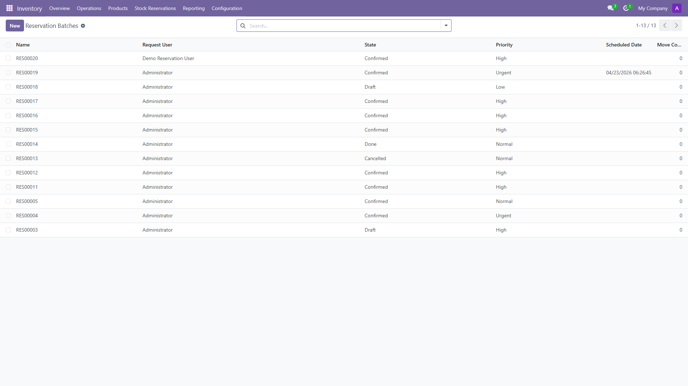
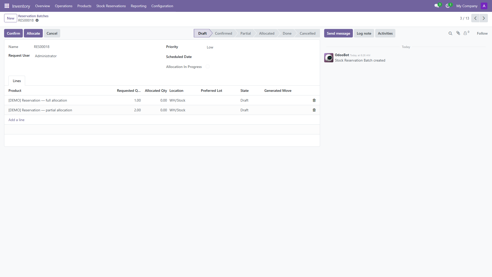
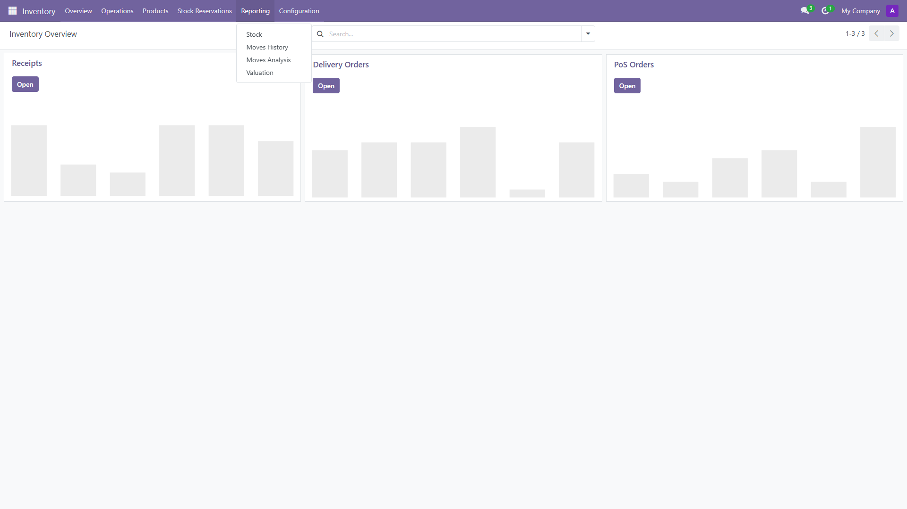

# Stock Reservation Engine

## Overview
This module adds a custom reservation and allocation layer on top of Odoo Inventory. It allows a user or an external system to create a reservation batch, allocate stock proactively from `stock.quant`, apply FEFO when lot expiration data exists, fall back to FIFO otherwise, and generate `stock.move` records that reflect the allocated quantity.

The objective is to support high-volume scenarios where competing demands may request the same stock before normal fulfillment flows are executed.

## Screenshots

Screenshots ship under Odoo’s standard asset path **`static/description/screenshots/`** (available in the Apps UI when listed, and ideal for README / assignment packages).

| Folder | Script | Purpose |
|--------|--------|---------|
| `static/description/screenshots/capture/` | `tools/screenshots/` → `npm run capture` | Broad inventory + reservation UI tour |
| `static/description/screenshots/walkthrough/` | `tools/screenshots/` → `npm run walkthrough` | Structured assignment walkthrough ([index](static/description/screenshots/walkthrough/SCREENSHOTS_INDEX.md)) |

**Examples** (refresh PNGs after install with demo data):







Full procedure: [static/description/screenshots/README.md](static/description/screenshots/README.md).

## Scope Delivered
- Custom models:
  - `stock.reservation.batch`
  - `stock.reservation.line`
  - `reservation.api.token`
- Allocation engine based on `stock.quant`
- FEFO / FIFO ordering
- Partial allocation support
- Generated `stock.move` per line when allocated quantity is greater than zero
- JSON API with token-based authentication
- Security groups and record rules
- Tree and form views with stock move smart button
- Odoo tests covering key scenarios

## Architecture Decisions
### Why Batch + Lines
The batch model acts as the business request container. The line model acts as the execution unit. Allocation is executed per line to keep the logic granular and to support mixed results inside one batch.

### Why `stock.quant`
`stock.quant` is the correct source for current physical stock availability. The engine calculates available quantity as:

`available_qty = quantity - reserved_quantity`

### Why FEFO then FIFO
If lots with valid expiration dates exist, the engine prioritizes the earliest expiration date first. Otherwise it falls back to FIFO using `in_date`, keeping stock selection deterministic.

### Why one move per line
The business request exists at line level, not quant level. Therefore the module generates one `stock.move` per line using the final allocated quantity, while keeping quant-level allocation abstracted.

## Functional Flow
1. User creates a reservation batch.
2. User adds one or more lines.
3. User confirms the batch.
4. User or API calls Allocate.
5. The engine searches `stock.quant` by product, location, and child locations.
6. It orders quants using FEFO or FIFO.
7. It calculates allocated quantity and updates line state.
8. If allocated quantity is greater than zero, it creates a stock move.
9. Batch state is derived from line states.
10. External systems can query the status endpoint.

## Sprint Plan
### Day 1
- Designed data model and states
- Implemented security groups, record rules, and access rights
- Built basic menu, tree view, and form view
- Added batch sequence

### Day 2
- Implemented allocation engine
- Added FEFO / FIFO ordering
- Added partial allocation support
- Added stock move generation and smart button

### Day 3
- Implemented JSON APIs and token authentication
- Added tests for full allocation, partial allocation, no stock, and FEFO
- Wrote README covering architecture, performance, database design, and concurrency
- Added lightweight application-level protection against double processing

### What I intentionally did NOT implement and why
- Full row-level locking on `stock.quant` was not fully implemented to keep the sprint focused on correctness and clarity of the core allocation flow.
- Picking generation was intentionally deferred because the assignment requires move generation, not full warehouse workflow orchestration.
- A dedicated quant allocation trace table was deferred to avoid over-engineering within the sprint scope.

## API Endpoints
### Create reservation
`POST /api/reservation/create`

Example payload:
```json
{
  "priority": "2",
  "scheduled_date": "2026-04-20 10:00:00",
  "lines": [
    {"product_id": 10, "qty": 5, "location_id": 8},
    {"product_id": 20, "qty": 2, "location_id": 8}
  ]
}
```

### Allocate reservation
`POST /api/reservation/allocate`

Example payload:
```json
{
  "batch_id": 12
}
```

### Reservation status
`GET /api/reservation/status/<id>`

### Authentication
The API expects a bearer token:

`Authorization: Bearer <token>`

Tokens are managed using the `Reservation API Tokens` menu.

## Demo environment (install-ready)
The module ships a **self-contained demo** for clean databases: warehouse **Main Demo Warehouse (MDW)**, internal sub-locations, product categories under **All / Reservation Demo**, storable demo products, lot-tracked perishables with **Products Expiration Date** (`product_expiry` dependency), and sample reservation batches. No manual inventory structure is required to try allocation.

### Data files
| File | Role |
|------|------|
| `data/demo_inventory_master.xml` | Company-scoped **MDW** warehouse (code `MDW`, standard receipt/delivery steps and routes from core `stock`), sub-locations (*Shelf A*, *Shelf B*, *Cold Zone* with FEFO removal strategy, optional *Quality Control*), product categories, product templates, lots (`LOT-X-001`, `LOT-X-002`, `LOT-Y-001`). |
| `data/reservation_demo_data.xml` | Users, API token records, reservation batches/lines referencing MDW stock. |

**Accounting:** demo uses default product categories and Odoo inventory configuration. No extra chart of accounts, journals, or valuation modes are introduced; add only if your company policy requires them.

### Stock levels (`hooks.ensure_demo_stock`)
Quantities are **not** stored in XML; `hooks.ensure_demo_stock()` adjusts `stock.quant` idempotently (safe to replay). Triggers:
- **`post_init_hook`** on first install.
- **`migrations/18.0.1.5.0/post-demo_stock.py`** when upgrading to **18.0.1.5.0+** (and the earlier migration for 18.0.1.0.2 remains for older upgrades).

| Product (template xml id) | Inventory layout |
|---------------------------|------------------|
| `demo_pt_full` — *Demo Product A* | **35 + 35** units on **Shelf A** and **Shelf B** under MDW/Stock (none on the stock root — exercises `child_of`). |
| `demo_pt_partial` — *Demo Product B* | **12** units on MDW **lot stock** root — partial vs **40** requested on `demo_batch_partial`. |
| `demo_pt_empty` — *Demo Product C* | **No** stock. |
| `demo_pt_lots` — *Perishable Product X* | **LOT-X-001**: **12** units in **Cold Zone**; **LOT-X-002**: **14** units in **Cold Zone**. Expiration dates set in the hook so **LOT-X-001** expires sooner (FEFO ordering). |
| `demo_pt_perishable_y` — *Perishable Product Y* | **No** stock (preferred-lot-not-available demo). |

### Users & API tokens (plaintext secrets — stored hashed)
| Login / name | Groups | Bearer secret (if applicable) |
|----------------|--------|-------------------------------|
| `admin` | Multi-warehouses, **Reservation Manager** (demo data) | `demo-reservation-api-token-change-me` (`demo_api_token`) |
| `demo_res_user` | Internal, stock user, multi-warehouses, **Reservation User** | `demo-res-user-api-token-change-me` (`demo_api_token_res_user`) |
| — | Inactive token record | `inactive-token-never-valid` (`demo_api_token_inactive`, `active=False`) — expect 401 |

### Reservation batches (xml ids) — quick checks
| Batch xml:id | Intent |
|--------------|--------|
| `demo_batch_draft` | Draft → **Confirm** → **Allocate** (Demo Product A). |
| `demo_batch_partial` | Partial line vs on-hand Demo Product B. |
| `demo_batch_empty` | Demo Product C — **not_available**. |
| `demo_batch_mixed` | Mixed line outcomes in one allocate. |
| `demo_batch_dual_full` | Two lines; batch can reach **allocated**. |
| `demo_batch_cancelled` | Cancelled snapshot. |
| `demo_batch_done` | Done snapshot. |
| `demo_batch_lot_ok` | Perishable X + preferred **LOT-X-001** with stock. |
| `demo_batch_lot_bad` | Perishable Y + preferred **LOT-Y-001**, **no** stock. |
| `demo_batch_fefo` | Perishable X — multi-lot FEFO from Cold Zone. |
| `demo_batch_shelf_parent` | Parent MDW/Stock line; quantity only under Shelf A/B (`child_of`). |
| `demo_batch_demo_user_owned` | Owned by `demo_res_user` (record rules / API). |

**Quick test:** Install module → **Inventory → Configuration → Warehouses** → open **Main Demo Warehouse** → review locations; **Reservation** menu → open `demo_batch_draft` → Confirm → Allocate.

To strip demo artefacts from a database, remove related records or restore a backup.

## Code reference (models & controllers)

### `stock.reservation.batch`
| Kind | Name | Role |
|------|------|------|
| Override | `create` | Assigns sequence `stock.reservation.batch` when `name` is `New`. |
| Compute | `_compute_move_count` | Counts lines that have a `stock.move`. |
| Button | `action_confirm` | Requires lines; sets batch `state` to `confirmed`. |
| Button | `action_cancel` | Cancels non-allocated lines; batch `cancelled`. |
| Button | `action_mark_done` | Sets batch `done`. |
| Button | `action_allocate` → `_action_allocate_single` | Runs allocation loop; guards with `allocation_in_progress` and valid states. |
| Core | `_allocate_line` | Walks `stock.quant` (FIFO by DB order or FEFO via Python sort when expiry lots exist); returns `allocated_qty` and first `lot_id` consumed. |
| Core | `_get_quant_order` | Returns whether to apply FEFO (any quant with lot + expiration on this product/location). |
| Core | `_compute_line_state` | Maps requested vs allocated → `not_available` / `partial` / `allocated`. |
| Core | `_compute_batch_state` | Aggregates line states into batch `draft` / `confirmed` / `partial` / `allocated` / `cancelled`. |
| Core | `_create_stock_move_for_line` | Creates `stock.move` from line location to `stock.stock_location_output` for allocated qty. |
| Button | `action_view_moves` | Opens stock moves for all lines (smart button). |

### `stock.reservation.line`
| Kind | Name | Role |
|------|------|------|
| Constraint | `_check_allocated_qty` | Ensures `allocated_qty` ≤ `requested_qty`. |
| SQL | *(constraints)* | `requested_qty > 0`, `allocated_qty >= 0`. |

### `reservation.api.token`
| Kind | Name | Role |
|------|------|------|
| Helper | `_hash_token` | SHA-256 hex digest of raw secret. |
| Override | `create` / `write` | Hashes `token` field on store. |

### HTTP (`controllers/api.py`)
| Route | Method | Handler | Behavior |
|-------|--------|---------|----------|
| `/api/reservation/create` | POST JSON | `create_reservation` | Bearer auth; builds batch + optional `auto_confirm`. |
| `/api/reservation/allocate` | POST JSON | `allocate_reservation` | Bearer auth; owner or manager; calls `action_allocate`. |
| `/api/reservation/status/<batch_id>` | GET | `reservation_status` | JSON detail of batch and lines. |
| *(helpers)* | | `_get_bearer_token`, `_authenticate`, `_json_error` | Authorization header parsing and token lookup (hashed match). |

## Security Model
- Reservation users can access only their own batches and lines.
- Reservation managers can access all records.
- **`action_allocate` is enforced on the server** (`AccessError` if unauthorized): callers must be either **Stock Reservation Manager** or the **batch owner** (`request_user_id`). UI button visibility may still narrow who sees **Allocate**, but RPC and API calls cannot bypass this check.
- API access is token-based and resolves to an Odoo user; API handlers call batch methods **with that user** (`with_user`) so authorization runs as the authenticated identity, not only as UI restrictions.

## Performance Strategy
### Avoiding N+1 queries
Each reservation line uses a single ordered `stock.quant` query. The implementation avoids nested per-quant reads and delegates sorting to the database.

### Critical query
The most important query is the `stock.quant` lookup filtered by:
- `product_id`
- `location_id` with `child_of`
- `company_id`
- `quantity > 0`
- optional `lot_id`

### Scaling approach
The current implementation is intentionally simple and clear. A future optimization would group lines by product and location to reuse quant result sets and reduce repeated searches when many lines target the same product.

### Time complexity
At a high level, allocation is linear in relation to the number of candidate quants returned for a line. Database ordering keeps the complexity predictable and avoids Python-side sorting overhead.

## Database Design
### Indexes
The module relies on indexes that matter for allocation lookups and joins.

Recommended / used indexes:
- `stock.quant(product_id)`
- `stock.quant(location_id)`
- `stock.quant(lot_id)`
- `stock.reservation.line(batch_id)`
- `stock.reservation.line(product_id)`
- `reservation.api.token(token)`

### Constraints
- `requested_qty > 0`
- `allocated_qty >= 0`
- ORM constraint to prevent `allocated_qty > requested_qty`

These constraints keep reservation data valid and guard against inconsistent updates.

## Concurrency Strategy
Concurrency is handled at the **application level** in this module. **Database row locking** (`SELECT FOR UPDATE` on `stock.quant` or related rows) is **not** implemented here; it remains a future hardening step for high-contention deployments.

### Current implementation
The module includes lightweight application-level protection using:
- state guards
- `allocation_in_progress` flag
- duplicate move prevention (one move per line; refresh qty on re-allocation)
- skipping lines that are already fully allocated with an existing move

This reduces accidental double processing from repeated clicks or repeated API calls.

### Risk
Two concurrent transactions may still read the same available quantity before commit, which can lead to over-allocation in high-contention scenarios.

### Production-grade mitigation
For production-grade concurrency safety, the next step would be:
1. Lock candidate `stock.quant` rows with `SELECT ... FOR UPDATE`
2. Execute allocation inside a single transaction
3. Optionally add retry logic for lock contention or serialization failures

## Testing
- **`TransactionCase`**: allocation scenarios (full, partial, no stock, FEFO), server-side allocation authorization (non-owner / non-manager denied).
- **`HttpCase`** (minimal): JSON-RPC `POST /api/reservation/create` — missing Bearer → structured error (`code`); valid Bearer + stock → success payload. HTTP tests **commit** created tokens/quants so the separate HTTP worker cursor can see them.

Covered scenarios (transaction tests):
1. Full allocation when enough stock exists
2. Partial allocation when available stock is lower than requested quantity
3. No-stock scenario
4. FEFO selection when lots have expiration dates

## Known Limitations
- Full database-level locking is not implemented. The `allocation_in_progress` flag is an application-level guard only. In a multi-worker environment two concurrent transactions can still read the same available quantity before either commits, potentially causing over-allocation. The production-grade solution is to lock candidate `stock.quant` rows with `SELECT ... FOR UPDATE` before the allocation loop.
- No picking generation. The module generates `stock.move` records but does not create full `stock.picking` objects.
- No quant allocation trace table. The chosen lot is stored on the line for traceability, but per-quant breakdown is not persisted.
- FEFO stores the first chosen lot on the line. It does not persist a quant-by-quant breakdown.
- No UoM conversion on reservation lines. The `uom_id` is taken from `product_id.uom_id` only. Lines with a different requested unit of measure are not supported.
- API tokens are hashed with SHA-256 on save. Existing tokens created before this version stored their value in plaintext and must be deleted and re-created. Raw token values are never retrievable after saving.
- The API has no rate limiting. This is acceptable for the current sprint scope. A production deployment should add throttling at the reverse-proxy or middleware level.
- Create/list paths still use `sudo()` where needed for cross-company/token lookup; sensitive actions (`action_allocate`, `action_confirm`) are invoked **with the authenticated API user** so record rules and `has_group` checks apply correctly.

## Installation
1. Copy the module folder into your custom addons path.
2. Update the app list.
3. Install **Stock Reservation Engine**.
4. Grant users either:
   - `Stock Reservation User`
   - `Stock Reservation Manager`
5. Create API tokens from **Inventory > Stock Reservations > API Tokens** if external access is needed.

## Manual Test Scenarios
### Scenario 1: Full allocation
- Create on-hand stock for a product
- Create a reservation batch with requested quantity lower than available quantity
- Confirm and allocate
- Expected result: line state `allocated`, move created

### Scenario 2: Partial allocation
- Create on-hand stock lower than requested quantity
- Confirm and allocate
- Expected result: line state `partial`, allocated quantity lower than requested quantity

### Scenario 3: No stock
- Create reservation without any available stock
- Confirm and allocate
- Expected result: line state `not_available`, no move created

### Scenario 4: FEFO behavior
- Create two lots with different expiration dates
- Add stock to both lots
- Allocate one line
- Expected result: the line prefers the earliest expiration lot

## Future Improvements
- Full concurrency-safe allocation with SQL row locking (`SELECT FOR UPDATE` on `stock.quant`)
- Quant allocation trace model for full per-quant breakdown
- Picking generation from allocated moves
- Batch priority scheduling across multiple pending reservations
- API versioning and structured error codes
- API token expiry dates and scope restrictions
- Rate limiting at API layer
